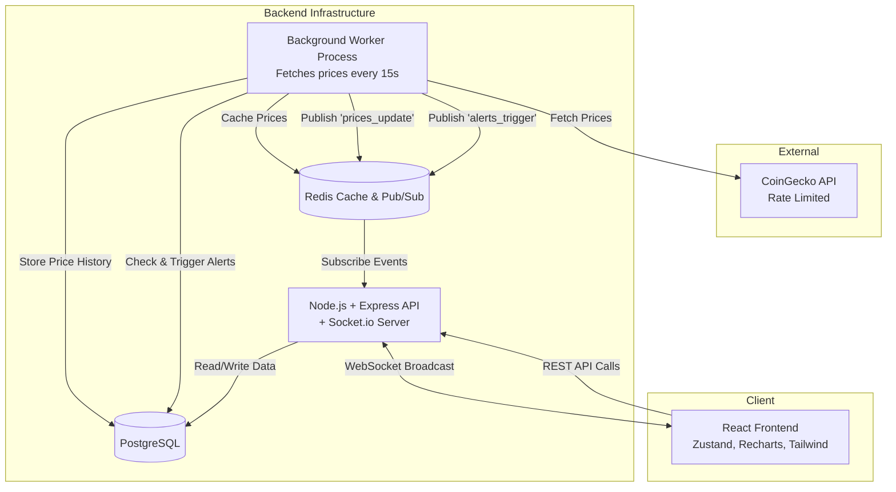

# Architecture Diagram

## Key Decisions
1. **Separation of Concerns:** The background worker runs in a separate container/process from the main API server. This ensures that heavy processing or API rate limiting does not block HTTP requests to the API server.
2. **Redis Pub/Sub:** Used to bridge communication between the isolated worker process and the WebSocket server for real-time notifications.
3. **Database Caching:** Redis caches the latest prices to serve `GET /api/prices/live` instantly, preventing unnecessary database load and avoiding CoinGecko rate limits.
