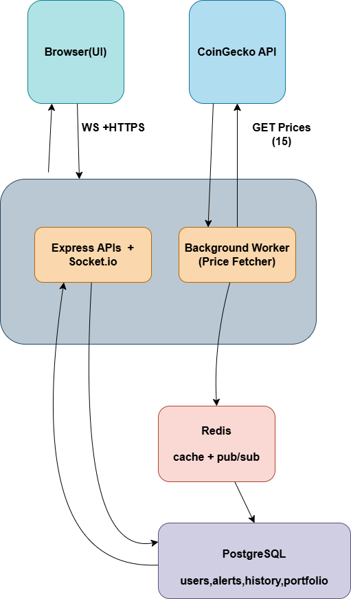

# NovaTrade — System Architecture

## Full System Architecture Diagram



---

## Key Design Decisions

### 1. Redis as the Communication Backbone
The Background Worker and the API Server run as **separate Node.js processes** and cannot share memory. Redis Pub/Sub acts as the message broker between them. The worker publishes events; the WebSocket server subscribes and forwards them to browsers over persistent WebSocket connections. This decouples the data pipeline from the HTTP layer.

### 2. Two Redis Connections in the WebSocket Service
`websocket.ts` creates a **dedicated** ioredis instance for subscribing (`redisSubscriber`), separate from the shared `redis` client used for caching. This is a hard requirement of Redis — a connection in subscribe mode cannot send any other commands.

### 3. Single Container Deployment (Free Tier Optimized)
On Render's free tier, only one Web Service is available. The `start:all` npm script runs both `dist/server.js` and `dist/worker.js` in the same container using shell `&` to background the server process. `prisma db push` runs before both to ensure the schema is always synced.

### 4. JWT Stored in localStorage via Zustand
The Zustand store initializes `token` from `localStorage.getItem('token')`, making auth persist across page refreshes. On logout, `setToken(null)` removes it. The token is decoded client-side using `jwt-decode` (no extra API call) to extract the user's email for display and the user's ID for targeted WebSocket alert subscriptions.

### 5. Alert Lifecycle: Create → Evaluate → Delete
Alerts are **one-shot triggers**. Once a price condition is met, the worker immediately `DELETE`s the alert from the database and publishes the trigger event. This prevents duplicate notifications and automatically cleans up the database.

### 6. Zod Validation on All Inputs
Every route that accepts a request body parses it through a `z.object()` schema before touching the database. This provides type-safe, human-readable validation errors and protects against malformed data.

---

## Request Lifecycle (Protected Endpoint Example)

```
Browser → HTTPS POST /api/alerts → Render
    └─▶ auth middleware: verify JWT Bearer token
           ├─ invalid → 401/403
           └─ valid   → req.user.id attached
              └─▶ alerts.ts route handler
                     └─▶ Zod validate body
                            ├─ invalid → 400
                            └─ valid
                               └─▶ prisma.alert.create(...)
                                      └─▶ Neon PostgreSQL
                                             └─▶ 201 { alert }
```

## Data Flow Summary

| Flow | Trigger | Path |
|------|---------|------|
| Live prices to browser | Every 15s | Worker → Redis PUBLISH → WS Server → Socket.IO emit → Zustand store → React re-render |
| Price history API | User visits `/coin/:id` | Browser → GET /api/prices/history/:id → Prisma → Neon → JSON |
| Alert creation | User submits form | Browser → POST /api/alerts → JWT check → Prisma → Neon |
| Alert trigger notification | Price condition met | Worker evaluates → DELETE alert → Redis PUBLISH → WS Server → `alert_userId` socket event → toast |
| Portfolio P&L | Real-time | Zustand prices × DB positions (client-side computation, no extra API call) |
